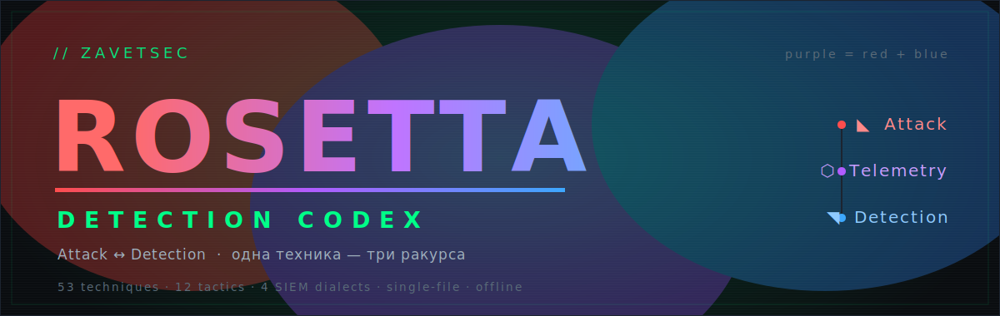

<div align="center">
  
</div>

<div align="center">

# ZavetSec Rosetta · Attack ↔ Detection

**Интерактивный Detection Codex: одна техника ATT&CK — три ракурса. Чем атакуют, какой след это оставляет в логах, как это выявить. Синее зеркало [Pentest Codex](https://github.com/zavetsec/pentestcodex).**

`Один HTML-файл. No install. No dependencies. No CDN. No telemetry. Полностью офлайн.`


*Attack-informed defense. Detection-aware offense.*

🌐 **Live:** [zavetsec.github.io/rosetta](https://zavetsec.github.io/rosetta/) &nbsp;·&nbsp; 📦 **File:** `zavetsec-rosetta.html` (single, self-contained)

</div>

---

## На каждую технику ATT&CK Rosetta даёт:

- 🔴 **атакующую команду** — чем это исполняют на практике
- ⬡ **телеметрию** — источник лога и конкретный Event ID
- ⚙ **пререкизиты логирования** — что включить (`auditpol`, GPO, Sysmon EID), чтобы событие вообще появилось
- 🔵 **готовое правило детекта** — под выбранный SIEM, с заметками по FP и тюнингу
- ✅ **самооценку покрытия** — отметь, что у тебя реально настроено, и увидь свои гэпы

> Слой пререкизитов — то, что редко документируется вместе с правилами детекта: правило бесполезно, если нужный аудит не включён. Здесь связка «техника → что залогировать → как выявить» собрана в одном месте.

---

## Preview

<div align="center">


<p align="center"><i>Матрица покрытия, самооценка и трёхпанельный workflow Attack → Telemetry → Detection.</i></p>

</div>

---

## В цифрах

- **53** техники ATT&CK
- **12** тактик kill-chain
- **41 Atomic** + **12 Behavioral** правил детекта
- **10** правил в формате Sigma v2 correlation
- **4** диалекта детекта — `Sigma · Splunk SPL · Sentinel KQL · Elastic / Wazuh`
- **1** HTML-файл · **0** зависимостей · **0** внешних запросов

---

## Быстрый старт

```text
Скачай zavetsec-rosetta.html  →  открой в браузере  →  выбери SIEM  →  отмечай покрытие
```

Ни сборки, ни сервера, ни зависимостей. Или сразу открой [live-версию](https://zavetsec.github.io/rosetta/).

```bash
git clone https://github.com/zavetsec/rosetta.git
# затем открой zavetsec-rosetta.html в браузере
```

---

## Концепция

Слоган бренда — `purple = red + blue` — здесь стал интерфейсом. Клик по технике раскрывает три панели:

```
  ◣ Attack            ⬡ Telemetry              ◥ Detection
  ───────────         ──────────────           ───────────────
  что запускается  →  след в логах          →  правило под SIEM
  (команда)           (источник · Event ID)     + пререкизиты
                      + что включить            + FP / tuning
       red       →        purple          →         blue
```

```
                 ATT&CK Technique
                        │
                        ▼
        Attack  →  Telemetry  →  Detection
                        │
                        ▼
               Coverage Assessment
                        │
                        ▼
                  Sigma Export
```

---

## Зачем

Rosetta дополняет привычные инструменты, закрывая ровно то, что каждый из них оставляет за скобками:

- **ATT&CK Navigator** отлично визуализирует покрытие — Rosetta добавляет к технике сам контент детекта.
- **SigmaHQ** даёт тысячи правил — Rosetta добавляет слой «что нужно залогировать», без которого правило не сработает.
- **DeTT&CT** помогает оценивать источники, но живёт в YAML/CLI — Rosetta делает оценку покрытия интерактивно, прямо в браузере.

Rosetta объединяет три обычно разрозненных слоя — контент детекта, требования к телеметрии и оценку покрытия — в одном автономном инструменте, который работает в air-gap.

---

## ◥ Возможности инструмента

*Что отдаётся на каждую технику — в блоке выше. Здесь — функции самого инструмента:*

- **Самооценка покрытия** — статус `Покрыто · Частично · Не покрыто` на каждой технике, общий процент и разбивка по тактикам; **экспорт/импорт в JSON** для бэкапа, версионирования и передачи команде
- **Фильтр матрицы по статусу** — «показать только Не покрыто» для фокуса на гэпах
- **Экспорт Sigma** — по одной технике или весь кодекс одним бандлом, с метаданными (`id`, `tags: attack.*`, `references`, `date`); поведенческие правила — настоящий **Sigma v2 correlation** (`event_count` / `value_count` / `temporal_ordered`)
- **Тег типа детекта** — `Atomic` (одно событие) vs `Behavioral` (порог / корреляция / baseline)
- **Deep-linking** — прямая ссылка на технику (`…#T1003.001`), открывается сразу
- **Дата ревизии**, пояснение шкалы severity, текстовый поиск по технике / инструменту / типу детекта
- **Офлайн-first** — один HTML-файл, ноль зависимостей и внешних запросов, работает в air-gap; адаптивен под десктоп и телефон

---

## ◣ Покрытие

Фокус текущей версии — сценарии атак в **Windows, Active Directory и облачных identity-платформах**. Linux/macOS и сетевые техники в набор пока не входят.

53 техники по 12 тактикам ATT&CK:

| Тактика | # | Техники |
|---------|:-:|---------|
| **TA0001** Initial Access | 4 | Spearphishing Attachment · Exploit Public-Facing App · External Remote Services · Valid Cloud Accounts |
| **TA0002** Execution | 4 | PowerShell · Scheduled Task · WMI Execution · Visual Basic / WScript |
| **TA0003** Persistence | 6 | Run / RunOnce Key · Create Local Account · Windows Service · WMI Event Subscription · Add Cloud Credentials · Create Cloud Account |
| **TA0004** Privilege Escalation | 4 | Bypass UAC · Token Impersonation · Process Injection · Federation Trust Mod |
| **TA0005** Defense Evasion | 7 | Rundll32 Proxy Exec · Disable Security Tools · Clear Event Logs · Mshta · Masquerading · DLL Side-Loading · Modify MFA / Auth |
| **TA0006** Credential Access | 9 | LSASS Dump · Kerberoasting · DCSync · Brute Force / Spray · SAM Hives · NTDS.dit · Browser Credentials · MFA Fatigue · OAuth Consent Grant |
| **TA0007** Discovery | 4 | Account Discovery · Remote System Discovery · Network Service Scanning · Domain Trust Discovery |
| **TA0008** Lateral Movement | 4 | RDP · SMB / PsExec · WinRM / Remote PowerShell · Pass the Hash |
| **TA0009** Collection | 3 | Archive Collected Data · Local Data Staging · Cloud Storage Access |
| **TA0011** Command & Control | 3 | Web Protocol C2 · Ingress Tool Transfer · Protocol Tunneling |
| **TA0010** Exfiltration | 2 | Exfil over Protocol · Exfil to Cloud Storage |
| **TA0040** Impact | 3 | Data Encrypted (Ransomware) · Service Stop · Account Access Removal |

---

## Диалекты детекта

| Диалект | Под что | Статус |
|---------|---------|--------|
| **Sigma** | универсальный, конвертится во всё через `sigma-cli` | выверен · экспортируется как `.yml` |
| **Splunk SPL** | Splunk ES | выверен |
| **Microsoft Sentinel KQL** | Sentinel / Defender XDR | выверен |
| **Elastic / Wazuh** | Elastic Security и Wazuh — оба синтаксиса в одной панели | выверен |

Для **Elastic / Wazuh** в панели даётся и EQL/DSL Elastic, и полевой синтаксис Wazuh (`data.win.eventdata.*`). Облачные техники используют cloud-logsource: Entra ID `SigninLogs` / `AuditLogs`, AWS CloudTrail.

---

## Как пользоваться

1. **Выбери диалект SIEM** вверху — все запросы переключатся на него.
2. **Открой технику** — три панели «атака → телеметрия + пререкизиты → детект» с копированием и `⬇ Sigma .yml`.
3. **Оцени покрытие** — `Покрыто / Частично / Не покрыто`; фильтруй матрицу по статусу и следи за процентом.
4. **Экспортируй** — Sigma (по одной технике или весь кодекс бандлом) и оценку покрытия в JSON.

> **Air-gap:** один файл, ноль внешних запросов, ноль зависимостей. Работает с локального диска и в изолированных сетях.

---

## Честно о границах

- Это **выверенный базовый набор**, а не полное покрытие ATT&CK (200+ техник). Гэп-анализ показывает дыры относительно этих 53 техник, а не «всего, что бывает».
- Запросы — **стартовый уровень детекта**, требуют тюнинга порогов и allowlist под вашу среду. Это референс и каркас, не «развернул и забыл».
- Поведенческие правила экспортируются как **Sigma v2 correlation** — для развёртывания пропусти через `sigma-cli` с pipeline под свой backend.
- Самооценка покрытия хранится в `localStorage` браузера — для команды экспортируй/импортируй JSON.

---

## Purple by design

Rosetta — **синяя половина** того же процесса, что красный [Pentest Codex](https://github.com/zavetsec/pentestcodex). Там — как атакуют, здесь — как это поймать. Две книги одного workflow:

> 🔴 **Pentest Codex** — как действует атакующий: техника · инструмент · команда
> 🟣 **Rosetta** — как это ловит защита: телеметрия · пререкизиты · правило

```
RED   Pentest Codex      —  техника, инструмент, команда
BLUE  Rosetta            —  телеметрия, пререкизиты, правило детекта
                            ▲
                   одна и та же техника ATT&CK
```

---

<details>
<summary><b>Design Standard</b> — фирменный стиль ZavetSec</summary>

<br>

- `#0a0d10` тёмный фон — читаемо в SOC в 3 часа ночи
- `#00ff88` зелёный акцент · красный → фиолетовый → синий как метафора purple
- **JetBrains Mono** для кода, **Rajdhani** для заголовков
- Severity-бейджи, MITRE ATT&CK инлайн, scanline, radial glow
- 100% self-contained HTML — один файл, no CDN, no external requests

</details>

---

<div align="center">

*Attack-informed defense. Detection-aware offense.*
*MIT Licensed — open, practical, unrestricted.*

**[zavetsec.github.io/rosetta](https://zavetsec.github.io/rosetta/)** · part of the [ZavetSec](https://github.com/zavetsec) purple toolkit

</div>
